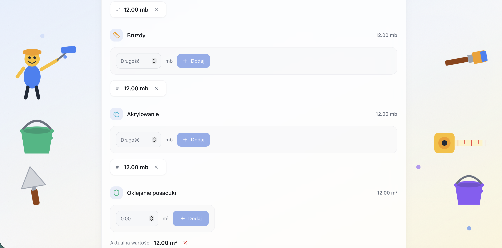
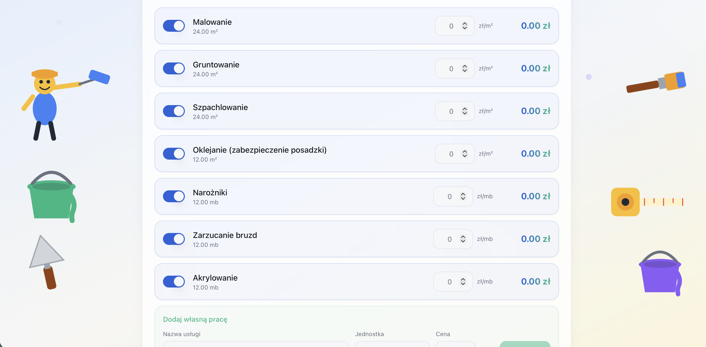
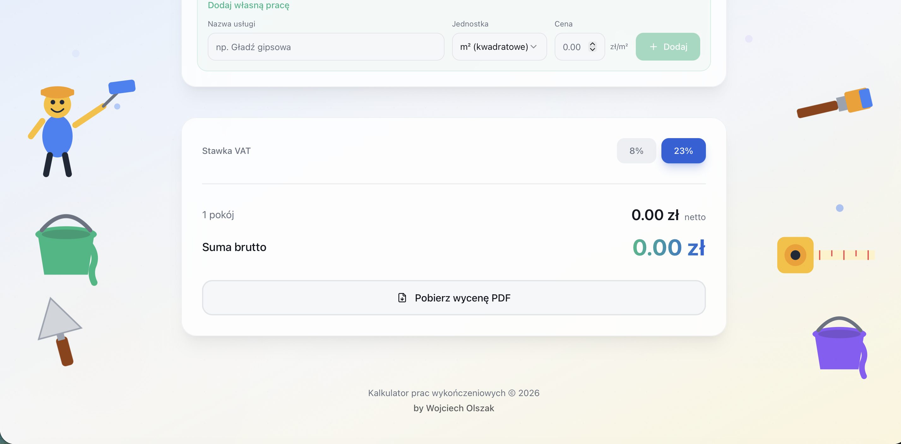
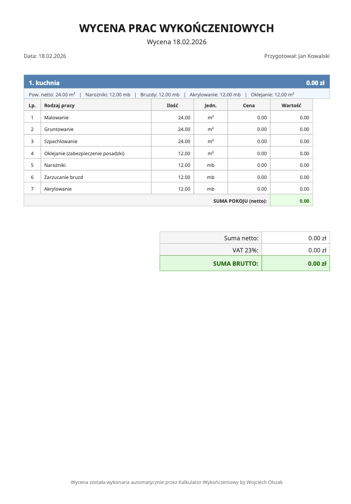

# renovation-cost-app


A professional web-based calculator for interior finishing and renovation works in Poland. Users define rooms with walls and ceilings, select work types with per-unit pricing, and the application calculates total costs including VAT. Supports PDF quote export, user authentication, and full quote management.

## Screenshots

### Landing Page & Calculator

<p align="center">
  
</p>

<p align="center">
  <sub>Landing page with login, registration, and guest mode options</sub>
</p>

<p align="center">
  
</p>

<p align="center">
  <sub>Main calculator view in guest mode — company name input and "Add room" prompt</sub>
</p>

### Room Configuration

<p align="center">
  
</p>

<p align="center">
  <sub>Room dimension inputs: walls (m&sup2;), ceilings (m&sup2;), and corner beads (mb)</sub>
</p>

<p align="center">
  
</p>

<p align="center">
  <sub>Additional measurements: grooves (mb), acrylic caulking (mb), and floor protection (m&sup2;)</sub>
</p>

### Work Types & Pricing

<p align="center">
  
</p>

<p align="center">
  <sub>Toggleable work items with auto-calculated quantities and per-unit pricing (PLN/m&sup2; or PLN/mb)</sub>
</p>

<p align="center">
  
</p>

<p align="center">
  <sub>Custom work form, VAT rate selection (8% / 23%), net and gross totals, PDF export button</sub>
</p>

### PDF Export

<p align="center">
  
</p>

<p align="center">
  <sub>PDF format picker: Standard (clean text layout) or Table/Excel (spreadsheet-style with borders)</sub>
</p>

<p align="center">
  &nbsp;&nbsp;
  
</p>

<p align="center">
  <sub>Generated PDF quotes: Standard layout (left) · Table/Excel layout (right)</sub>
</p>

---

## Features

- **Room-based cost calculation** -- define rooms with custom wall and ceiling dimensions
- **Multiple work types** -- Painting, Priming, Spackling, Floor Protection, Corner Beads, Groove Filling, Acrylic Caulking, and custom types
- **Per-unit pricing** -- area-based (m2) and length-based (mb) depending on work type
- **VAT calculation** -- 8% and 23% rates
- **PDF export** -- professional quotes in standard or table format via jsPDF
- **User authentication** -- Supabase Auth with registration and login
- **Quote management** -- save, load, edit, and delete quotes from the cloud
- **Responsive design** -- desktop and mobile
- **Animated UI** -- Framer Motion transitions

## Tech Stack

| Component | Technology |
|-----------|------------|
| Frontend | React 18, TypeScript, Vite |
| Styling | Tailwind CSS, shadcn/ui |
| Backend | Supabase (PostgreSQL, Auth) |
| PDF | jsPDF |
| Animations | Framer Motion |

## Getting Started

### Prerequisites

- Node.js 18+, npm
- A Supabase project (for backend and auth)

### Installation

```bash
git clone https://github.com/selter2001/renovation-cost-app.git
cd renovation-cost-app
npm install
```

### Environment setup

Create a `.env` file in the project root:

```env
VITE_SUPABASE_URL=https://your-project.supabase.co
VITE_SUPABASE_ANON_KEY=your-anon-key
```

### Running

```bash
npm run dev          # development server at http://localhost:5173
npm run build        # production build
```

## Architecture

**React 18 + TypeScript + Vite** frontend with **Supabase** backend:

```
src/
├── components/        # UI components (rooms, work types, quotes, auth)
├── hooks/             # Custom React hooks
├── lib/               # Supabase client, utilities
├── pages/             # Route-level pages
├── types/             # TypeScript definitions
└── App.tsx            # Root component with routing
```

The frontend handles room definitions, work type selection, cost computation with VAT, and PDF generation client-side. Supabase provides PostgreSQL storage, row-level security, and authentication. The UI uses shadcn/ui styled with Tailwind CSS and animated with Framer Motion.

## Author

**Wojciech Olszak** -- [github.com/selter2001](https://github.com/selter2001)

## License

This project is licensed under the MIT License.

---

# renovation-cost-app


Profesjonalny kalkulator webowy do wyceny prac wykończeniowych i remontowych w Polsce. Użytkownicy definiują pomieszczenia ze ścianami i sufitami, wybierają rodzaje prac z cenami jednostkowymi, a aplikacja oblicza koszty z VAT. Eksport wycen do PDF, autoryzacja i zarządzanie kosztorysami.

## Zrzuty ekranu

### Strona startowa i kalkulator

<p align="center">
  
</p>

<p align="center">
  <sub>Strona startowa z opcjami logowania, rejestracji i trybu gościa</sub>
</p>

<p align="center">
  
</p>

<p align="center">
  <sub>Widok kalkulatora w trybie gościa — dane firmy i przycisk „Dodaj pokój"</sub>
</p>

### Konfiguracja pomieszczenia

<p align="center">
  
</p>

<p align="center">
  <sub>Wymiary pomieszczenia: ściany (m&sup2;), sufity (m&sup2;) i narożniki (mb)</sub>
</p>

<p align="center">
  
</p>

<p align="center">
  <sub>Dodatkowe pomiary: bruzdy (mb), akrylowanie (mb) i oklejanie posadzki (m&sup2;)</sub>
</p>

### Rodzaje prac i wycena

<p align="center">
  
</p>

<p align="center">
  <sub>Prace z automatycznie obliczonymi ilościami i cenami jednostkowymi (zł/m&sup2; lub zł/mb)</sub>
</p>

<p align="center">
  
</p>

<p align="center">
  <sub>Formularz niestandardowej pracy, wybór stawki VAT (8% / 23%), sumy netto i brutto, eksport PDF</sub>
</p>

### Eksport PDF

<p align="center">
  
</p>

<p align="center">
  <sub>Wybór formatu: Standardowy (czysty układ tekstowy) lub Tabelkowy/Excel (z ramkami i tabelami)</sub>
</p>

<p align="center">
  &nbsp;&nbsp;
  
</p>

<p align="center">
  <sub>Wygenerowane wyceny PDF: Układ standardowy (lewy) · Układ tabelkowy/Excel (prawy)</sub>
</p>

---

## Funkcjonalności

- **Kalkulacja na podstawie pomieszczeń** -- definiowanie pomieszczeń z wymiarami ścian i sufitów
- **Wiele rodzajów prac** -- Malowanie, Gruntowanie, Szpachlowanie, Zabezpieczenie podłogi, Narożniki, Wypełnianie bruzd, Akryl oraz typy niestandardowe
- **Ceny jednostkowe** -- wycena powierzchniowa (m2) i długościowa (mb)
- **Obliczanie VAT** -- stawki 8% i 23%
- **Eksport PDF** -- kosztorysy w formacie standardowym lub tabelarycznym (jsPDF)
- **Autoryzacja** -- rejestracja i logowanie przez Supabase Auth
- **Zarządzanie kosztorysami** -- zapis, odczyt, edycja i usuwanie wycen z chmury
- **Responsywny design** -- komputer i urządzenia mobilne
- **Animowany interfejs** -- płynne przejścia Framer Motion

## Stos technologiczny

| Komponent | Technologia |
|-----------|-------------|
| Frontend | React 18, TypeScript, Vite |
| Stylizacja | Tailwind CSS, shadcn/ui |
| Backend | Supabase (PostgreSQL, Auth) |
| PDF | jsPDF |
| Animacje | Framer Motion |

## Uruchomienie

### Wymagania

- Node.js 18+, npm
- Projekt Supabase (backend i autoryzacja)

### Instalacja

```bash
git clone https://github.com/selter2001/renovation-cost-app.git
cd renovation-cost-app
npm install
```

### Konfiguracja środowiska

Utwórz plik `.env` w katalogu głównym projektu:

```env
VITE_SUPABASE_URL=https://twoj-projekt.supabase.co
VITE_SUPABASE_ANON_KEY=twoj-klucz-anon
```

### Uruchomienie

```bash
npm run dev          # serwer deweloperski na http://localhost:5173
npm run build        # build produkcyjny
```

## Architektura

Frontend **React 18 + TypeScript + Vite** z backendem **Supabase**:

```
src/
├── components/        # Komponenty UI (pomieszczenia, prace, wyceny, auth)
├── hooks/             # Niestandardowe hooki React
├── lib/               # Klient Supabase, funkcje pomocnicze
├── pages/             # Komponenty stron (routing)
├── types/             # Definicje typów TypeScript
└── App.tsx            # Komponent główny z routingiem
```

Frontend obsługuje definiowanie pomieszczeń, wybór prac, obliczanie kosztów z VAT i generowanie PDF po stronie klienta. Supabase zapewnia PostgreSQL, zabezpieczenia RLS i autoryzację. UI korzysta z shadcn/ui, Tailwind CSS i Framer Motion.

## Autor

**Wojciech Olszak** -- [github.com/selter2001](https://github.com/selter2001)

## Licencja

Projekt jest objęty licencją MIT.
